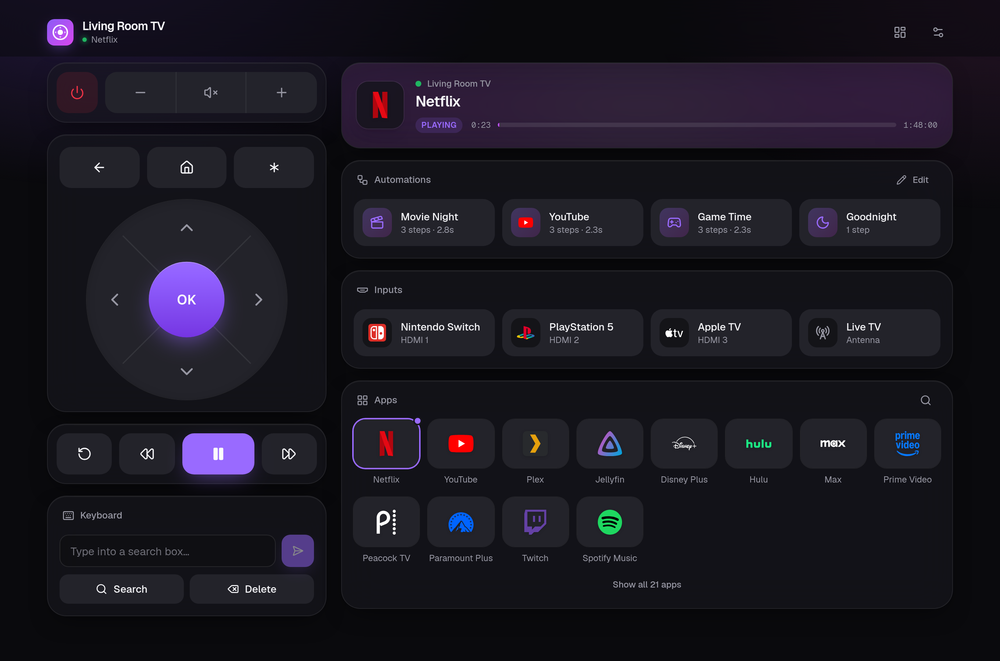
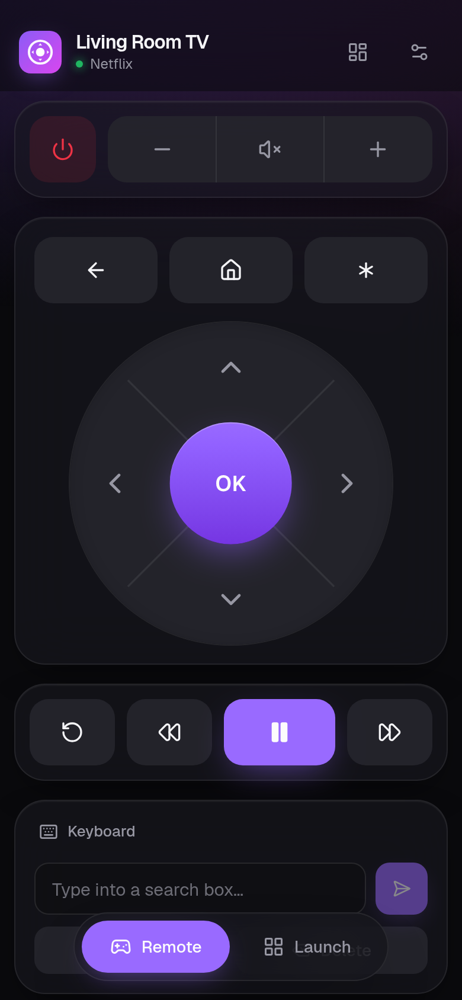
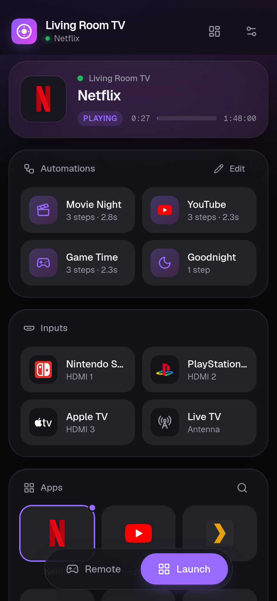

# Roku LAN Remote

A self-hosted web remote, live status dashboard and automation runner for Roku
TVs, packaged as a single Docker container. It talks to the TV over Roku's
built-in [External Control Protocol](https://developer.roku.com/docs/developer-program/dev-tools/external-control-api.md)
(ECP, port 8060), the same API the official mobile app uses, so nothing ever
leaves your network.

<p align="center">
  
</p>
<p align="center">
  
  
</p>

- **Live status**: power, current app with artwork, play/pause and a live progress bar
- **Full remote**: D-pad, playback, volume and power. Works *inside* apps (YouTube, Netflix, …)
- **Apps and inputs** with crisp brand logos, search, and one-tap HDMI/antenna switching
- **Keyboard**: type into TV search and login boxes
- **Automations**: build one-tap scenes visually; each one is also a webhook
- **Modular layout**: show, hide, reorder and move every module between columns
- **Built for phones too**: installs to the home screen, with a thumb-friendly tab bar and bottom sheets
- **Light, dark or auto** theme

## Quick start (Docker)

```sh
git clone https://github.com/scopeddlol/dockerized-roku-remote.git
cd dockerized-roku-remote
docker compose up -d --build
```

Open `http://<host-ip>:8000`, tap **Set up** and then **Scan**, and pick your TV.
That's it.

- On the TV, enable **Settings → System → Advanced system settings →
  Control by mobile apps → Network access → Default**.
- On an iPhone, use **Share → Add to Home Screen** for a fullscreen app.
- Your TV choice and automations are stored in the `roku-data` volume, so they
  survive rebuilds.

### Configuration

| Variable | Default | Purpose |
|---|---|---|
| `PORT` | `8000` | Port the web UI listens on (use `80` for a bare `http://tv.lan`) |
| `TV_IP` | empty | Preset the TV's address instead of choosing it in Settings |

Set them in a `.env` file next to `compose.yaml`, or inline:
`PORT=80 docker compose up -d`.

### Networking: Linux vs. Docker Desktop

`compose.yaml` uses **host networking** so the container can send the SSDP
broadcast that finds Rokus automatically. That works on Linux, which covers
most home servers, NASes and Raspberry Pis.

On **Docker Desktop (macOS/Windows)**, use bridge mode:

```sh
docker compose -f compose.yaml -f compose.bridge.yaml up -d --build
```

Controlling the TV works exactly the same. Only auto-discovery is limited: in
Settings, open *Scan a specific subnet* and enter your LAN prefix (for example
`192.168.1`), or just type the TV's IP. You can find it on the TV under
**Settings → Network → About**.

### Try it without a TV

A mock Roku ships in `dev/` for development and demos:

```sh
docker compose -f compose.yaml -f compose.bridge.yaml -f dev/compose.mock.yaml up --build
```

## Customizing the layout

Tap the **layout** icon in the header to:

- toggle any module on or off (*Live TV* and *Shortcuts* start hidden),
- drag modules to reorder them,
- move a module between the **Remote** column and the **Dashboard** column.
  On phones these become the *Remote* and *Launch* tabs.

Layouts are saved per device, so your phone and your desktop can differ.

## Automations

Open **Automations → Edit** to build scenes from four step types: *Press* a
remote key, *Open* an app or input, *Wait*, and *Type* text. Drag to reorder
the steps and pick an icon.

Every automation is also an HTTP endpoint, so Apple Shortcuts, Siri, Home
Assistant or cron can trigger it (the copy button in the editor gives you this
line):

```sh
curl -X POST "http://<host-ip>:8000/api/macro/Movie%20Night"
```

Automations live in `/data/macros.json` in the volume:

```json
{ "name": "Movie Night", "icon": "clapperboard", "steps": [
  { "type": "keypress", "value": "PowerOn" },
  { "type": "delay", "value": 2500 },
  { "type": "launch", "value": "12" },
  { "type": "text", "value": "stranger things" }
]}
```

## API

| Route | Description |
|---|---|
| `GET /api/status` | power, active app, play state, position |
| `GET /api/apps` | installed apps and inputs, with launch IDs |
| `GET /api/icon/<id>` | an app's artwork, served by the TV |
| `POST /api/keypress/<key>` | press a remote key (`Home`, `Select`, `VolumeUp`, …) |
| `POST /api/launch/<id>` | launch an app or switch input (`12`, `tvinput.hdmi1`, …) |
| `POST /api/text` | body `{"text": "hello"}` types on the TV |
| `GET/POST /api/macros` | read or replace the automation list (validated) |
| `POST /api/macro/<name>` | run one automation |
| `GET/POST /api/config` | read or set the TV address `{"tv_ip": "…"}` |
| `GET /api/discover?subnet=192.168.1` | find Rokus on the network |
| `GET /api/health` | container health check |

## A memorable URL (`http://tv.lan`)

Give the Docker host a DHCP reservation, then add a local DNS record pointing
`tv.lan` at it. On OpenWrt/GL.iNet routers:

```sh
uci add dhcp domain
uci set dhcp.@domain[-1].name='tv.lan'
uci set dhcp.@domain[-1].ip='<host-ip>'
uci commit dhcp && /etc/init.d/dnsmasq restart
```

Run with `PORT=80` for a bare `http://tv.lan`. Use a dotted name: Apple
devices won't resolve single-label hosts like `http://tv`.

## Development

```sh
python3 dev/mock_roku.py &                          # fake TV on :8060
TV_IP=127.0.0.1 python3 backend/server.py &         # API on :8000
cd web && npm install && npm run dev                # UI with hot reload on :5173
```

**Layout**

- `backend/`: stdlib-only Python (no pip installs)
  - `server.py`: HTTP routes and serving the built UI
  - `roku.py`: ECP client
  - `discovery.py`: SSDP and subnet scan
  - `storage.py`: config and automations, with validation
- `web/`: React 19, Vite, TypeScript and Tailwind CSS v4
  - `src/modules/`: one file per module, listed in `registry.tsx`
  - `src/components/ui/`: shadcn-style primitives on Radix UI
  - `src/lib/brands.ts`: maps app names to logos in `public/icons/brands`
- `dev/`: the mock Roku and its compose override

**Adding a module:** create a component in `web/src/modules/` and add one
line to `MODULES` in `registry.tsx`. It shows up in Customize automatically.

**Adding a brand logo:** drop `<slug>.svg` (plus `<slug>-light.svg` if it's
dark) into `web/public/icons/brands/` and add a match rule in `brands.ts`.

**UI stack:** [Radix UI](https://www.radix-ui.com) primitives styled the
[shadcn/ui](https://ui.shadcn.com) way, [Motion](https://motion.dev) for
animation, [dnd-kit](https://dndkit.com) for drag and drop,
[TanStack Query](https://tanstack.com/query) for live polling,
[Zustand](https://zustand.docs.pmnd.rs) for saved layout,
[Sonner](https://sonner.emilkowal.ski) toasts, [Vaul](https://vaul.emilkowal.ski)
drawers and the [Geist](https://vercel.com/font) typeface.

## Credits

- App logos: [selfh.st/icons](https://selfh.st/icons) (CC BY 4.0) and
  [Simple Icons](https://simpleicons.org) (CC0; the files prefixed `si-`).
  Brand logos are trademarks of their respective owners.
- UI icons: [Lucide](https://lucide.dev) (ISC).

## Limits

Roku only allows screen capture for sideloaded developer channels, so there's
no screenshot or video preview. There's also no API for arbitrary TV
settings; the remote can reach only what remote keys can.
